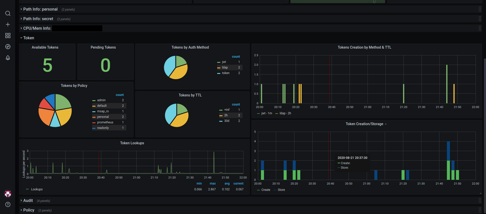

# HashiCorp Vault Playground
Bootstrap a Vault HA Cluster locally including TLS, Unsealing, HAProxy, Prometheus & Grafana in less than a minute!

## Demo


**This will expose:**
* HAProxy proxying the Vault UI using [Vaults Health Check](https://developer.hashicorp.com/vault/api-docs/system/health) under https://locahost 
* Prometheus UI under https://localhost:9090
* Grafana UI under https://localhost:3000

## Grafana Dashboard
> https://grafana.com/grafana/dashboards/12904-hashicorp-vault/


## Requirements
* Terraform
* Vault
* Docker
* jq

## Features
* Vault OSS
* Vault HA Cluster using Raft Storage
* TLS/SSL Settings
* Unsealing
* HAProxy includings Vaults Health Checks
* Prometheus Integration
* Grafana Dashboard

## Usage
```bash
# initialize terraform
terraform init

# boostrap
terraform apply

# source env vars
source .envrc

# test vault status
vault status
```

## Configuration
See `variables.tf` for configuration options:

```hcl
# create a terraform.tfvars and customize the settings
vault = {
  ip_settings        = "172.16.10.0/24"
  vault_enterprise   = false
  vault_version      = "1.15"
  vault_nodes        = 3
  autounseal_enabled = false
  keys = {
    shares    = 5
    threshold = 3
  }
}

haproxy = {
  enabled = true
}

prometheus = {
  enabled = true
}

grafana = {
  enabled = true
}
```

## Todos
* [x] tls certs
* [ ] Vault Enterprise
* [ ] vault auto unseal
* [ ] CI
* [ ] Docs
* [x] vault raft cluster
* [x] haproxy
* [x] grafana prometheus
* [ ] nodeexporter
* [ ] keycloak sso
