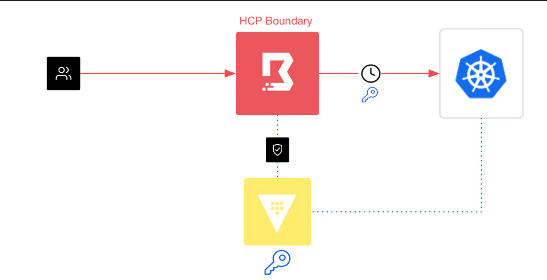

# Boundary

> https://www.hashicorp.com/blog/how-to-connect-to-kubernetes-clusters-using-boundary

## Description

* In thise use case a user requests kubernetes cluster credentials (token) for the local running minikube cluster
* Boundary then issues credentials utilizing Vaults Kubernetes Secret Engine
* the Token is only allowed to list pods in namespace default, as configured in the Vault Kubernetes Secret Engine
* the user receives a service account token and can then use `kubectl`

## Requirements
For this lab youre going to need `kubectl` and the [Boundary Desktop Application](https://developer.hashicorp.com/boundary/tutorials/oss-getting-started/oss-getting-started-desktop-app) on your system.

Also in your `terraform.tfvars`:

```yaml
# terraform.tfvars
boundary  = {
    enabled = true
}

kubernetes = {
  enabled = true
}
```

You then can bootstrap the cluster using

```bash
make bootstrap
```

## Overview

* Vault is used as Boundarys KMS Server using Vaults Transit Engine ([https://localhost/ui/vault/secrets/transit/list](https://localhost/ui/vault/secrets/transit/list))
* Vaults Secret Engine is configured for minikube for creating SAs that are allowed to LIST pods in the default namespace:

```json
# https://localhost/ui/vault/secrets/minikube/kubernetes/roles/minikube/details
{"rules":[{"apiGroups":[""],"resources":["pods"],"verbs":["list"]}]}
```

* a global organization: `playground`
* a projet: `minikube`
* an basic auth method `basic` with an admin account: `admin:password`
* an Admin Role, so the admin account can edit/view everything globally and project wide
* Vault is added as a Credential Store, and has received a proper token + policy
* Vault is used a a Credentials Library for Kubernetes SA
* A Host Catalog `minikube` has been created, containing the Minikubes API Server as a Host
* A Target `minikube` has been created, specifiyin the connection (tcp, port 443, ...)
* A Role for that target has been created and added to the admin user

## Walkthrough
* Start Boundary Desktop Application
* Connect to the local running boundary
* Choose the `minikube` Target and Click `connect`

```bash
# create any pod in default namespace
$> kubectl run nginx --image nginx

# create a new context
$> kubectl config set-context empty && kubectl config use-context empty

# connect with the received SA token
$> kubectl get pod --insecure-skip-tls-verify --server=https://127.0.0.1:8443 --token=<SA_TOKEN>
```
