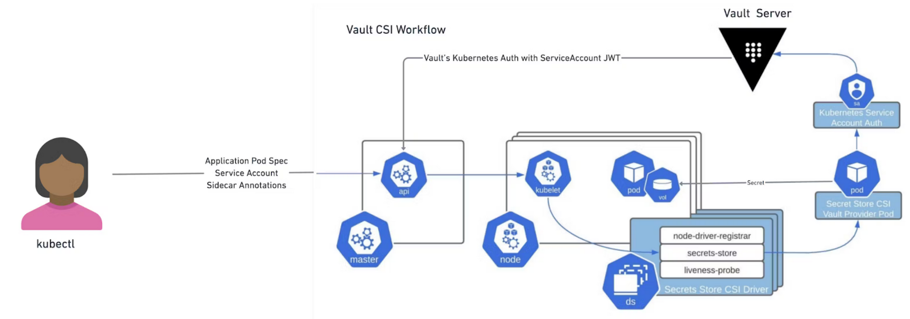

# Secret Store CSI Driver


> https://developer.hashicorp.com/vault/docs/platform/k8s/injector-csi

## Requirements
For this lab youre going to need `kubectl`, `helm` and `jq` installed.

Also in your `terraform.tfvars`:

```yaml
# terraform.tfvars
kubernetes = {
  enabled   = true
  csi       = true
}
```

You then can bootstrap the cluster using `make bootstrap`


## Overview
The following resources will be created:

1. The Vault Helm Chart is going to be installed in the `csi` Namespace.
2. The CSI Driver is installed using the official Helm Chart
3. A Kubernetes Auth Role `csi` bound to the `csi` Namespace & Service Account
4. KVv2 Secrets under `csi/secrets` containing 2 Example Secrets
5. A policy (`csi`) that allows reading `/csi/secrets` Secrets
6. A Secret Provider Class is created, describing which secret to read and to which secret to write it
7. A Demo App `kuard` is deployed wiht annotations that will get the secret created by the CSI driver attached and mounted and export that secret as an environment variable.

## Walkthrough
The CSI Driver and the Vault CSI Driver implementation (csi) is going to be installed in the `csi` namespace using the [Helm Chart](https://github.com/hashicorp/vault-helm).

```bash
$> helm list -n csi
helm list -n csi
NAME    NAMESPACE       REVISION        UPDATED                                 STATUS          CHART                           APP VERSION
csi     csi             1               2024-01-12 14:13:14.639161204 +0100 CET deployed        secrets-store-csi-driver-1.4.0  1.4.0
vault   csi             2               2024-01-12 14:15:14.327992163 +0100 CET deployed        vault-0.27.0                    1.15.2
```

Additionally, a Vault Kubernetes Auth Role bounded to the Namespace and the default Service Account has been created:

```bash
# https://localhost/ui/vault/access/minikube-cluster/item/role/csi
$> vault read auth/minikube-cluster/role/csi
Key                                 Value
---                                 -----
alias_name_source                   serviceaccount_uid
bound_service_account_names         [default]
bound_service_account_namespaces    [csi]
token_bound_cidrs                   []
token_explicit_max_ttl              0s
token_max_ttl                       0s
token_no_default_policy             false
token_num_uses                      0
token_period                        0s
token_policies                      [csi]
token_ttl                           1h
token_type                          default
```

Also KVv2 Secrets under `csi/secrets/` have been created:

```bash
# https://localhost/ui/vault/secrets/csi/kv/secrets/details?version=1
$> vault kv get csi/secrets
== Secret Path ==
csi/data/secrets

======= Metadata =======
Key                Value
---                -----
created_time       2024-01-12T13:13:03.077481563Z
custom_metadata    <nil>
deletion_time      n/a
destroyed          false
version            1

====== Data ======
Key         Value
---         -----
password    P@ssw0rd
username    Admin
```

A corresponding policy `csi` that allows reading the csi secrets has also been crated:

```bash
# https://localhost/ui/vault/policy/acl/csi
$> vault policy read csi
path "csi/" {
  capabilities = ["read", "list"]
}

path "csi/*" {
  capabilities = ["read", "list"]
}
```

A Demo App with annotations mounting `csi-secret` and exporting the username field as an env var:

```bash
$> cat k8s-vault-csi/files/kuard.yml
apiVersion: apps/v1
kind: Deployment
metadata:
  name: kuard
  namespace: csi
spec:
  selector:
    matchLabels:
      app: kuard
  replicas: 1
  template:
    metadata:
      labels:
        app: kuard
    spec:
      containers:
      - image: gcr.io/kuar-demo/kuard-amd64:1
        name: kuard
        # example for env var
        env:
            # export an attribute from the Secret as Env Var
          - name: USERNAME
            valueFrom:
              secretKeyRef:
                key: username
                name: csi-secret
        ports:
        - containerPort: 8080
        volumeMounts:
        # mount the secret
        - name: csi
          mountPath: /opt/secrets
          readOnly: true
      volumes:
        # attach the csi secret
        - name: csi
          csi:
            driver: secrets-store.csi.k8s.io
            readOnly: true
            volumeAttributes:
              secretProviderClass: vault-csi
```

a secretProviderClass CRD has been deployed:

```bash
$> cat k8s-vault-csi/files/secret_provider_class.yml
apiVersion: secrets-store.csi.x-k8s.io/v1
kind: SecretProviderClass
metadata:
  name: vault-csi
  namespace: csi
spec:
  provider: vault
  parameters:
    vaultAddress: https://host.minikube.internal
    vaultKubernetesMountPath: minikube-cluster
    vaultCACertPath: /opt/ca.crt
    roleName: csi
    objects: |
      - objectName: "password"
        secretPath: "csi/data/secrets"
        secretKey: "password"
      - objectName: "username"
        secretPath: "csi/data/secrets"
        secretKey: "username"
  secretObjects:
    - data:
      - key: username
        objectName: username
      secretName: csi-secret
      type: Opaque
```

That Provider Class applied, creates a k8s secret:

```bash
$> kubectl get secret -n csi csi-secret -o json | jq '.data | map_values(@base64d)'
{
  "username": "Admin"
}
```

When deploying `kuard.yml`, the Secret containing the KVv2 Secrets from `csi/secrets/` is available as an environment variable:

```bash
$> kubectl exec -n csi -it $(kubectl get pods -l=app=kuard -n csi --no-headers -o custom-columns=":metadata.name") -- env | grep USERNAME
USERNAME=Admin
```


# Resources
* [https://developer.hashicorp.com/vault/docs/platform/k8s/csi](https://developer.hashicorp.com/vault/docs/platform/k8s/csi)
* [https://secrets-store-csi-driver.sigs.k8s.io/introduction](https://secrets-store-csi-driver.sigs.k8s.io/introduction)
