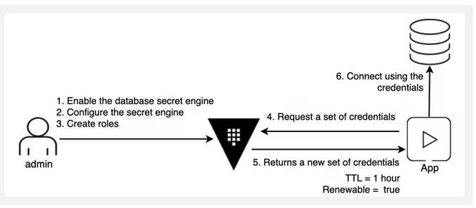

# Dynamic MySQL Database Credentials


> https://developer.hashicorp.com/vault/tutorials/db-credentials/database-secrets

## Requirements
You can enable this lab by setting:

```yaml
# terraform.tfvars
databases = {
  enabled = true
  mysql = true
}
```

You then can bootstrap the cluster using `make bootstrap`

## Overview
The following resources will be created:

1. A MySQL Container will be deployed
2. The Database secret engine will be enabled
3. A MySQL Database Connection will be created
4. A Database Role pointing to that MySQL DB will be created

## Walkthrough
A MySQL DB has been configured:

```bash
# https://localhost/ui/vault/secrets/databases/show/mysql
$> vault read databases/config/mysql
Key                                   Value
---                                   -----
allowed_roles                         [mysql]
connection_details                    map[connection_url:{{username}}:{{password}}@tcp(mysql:3306)/vault-playgound max_open_connections:2 username:root]
password_policy                       n/a
plugin_name                           mysql-database-plugin
plugin_version                        n/a
root_credentials_rotate_statements    []
```

A MySQL Role has been created:

```bash
# https://localhost/ui/vault/secrets/databases/show/role/mysql?type=dynamic
$> vault read databases/roles/mysql
Key                      Value
---                      -----
creation_statements      [CREATE USER '{{name}}'@'%' IDENTIFIED BY '{{password}}';GRANT SELECT ON *.* TO '{{name}}'@'%';]
credential_type          password
db_name                  mysql
default_ttl              1m
max_ttl                  0s
renew_statements         []
revocation_statements    []
rollback_statements      []
```

You can now generate MySQL Credentials:

```bash
$> vault read databases/creds/mysql
Key                Value
---                -----
lease_id           databases/creds/mysql/fnkxlDtia5R3UcNHXICZY4Vn
lease_duration     1m
lease_renewable    true
password           edljV1npo5tiiQ3crT-A
username           v-root-mysql-639DVnmggyE3xJE62i3
```

You can verify these credentials by using them:

```bash
$> mysql -h 127.0.0.1 -P 3306 -u v-root-mysql-639DVnmggyE3xJE62i3 --password=edljV1npo5tiiQ3crT-A
mysql: [Warning] Using a password on the command line interface can be insecure.
Welcome to the MySQL monitor.  Commands end with ; or \g.
Your MySQL connection id is 13
Server version: 8.2.0 MySQL Community Server - GPL

Copyright (c) 2000, 2023, Oracle and/or its affiliates.

Oracle is a registered trademark of Oracle Corporation and/or its
affiliates. Other names may be trademarks of their respective
owners.

Type 'help;' or '\h' for help. Type '\c' to clear the current input statement.

mysql>
```

**The Credentials are automatically revoked after 60 seconds**

Verify root credentials:

```bash
$> mysql -h 127.0.0.1 -P 3306 -u root --password=root
mysql: [Warning] Using a password on the command line interface can be insecure.
Welcome to the MySQL monitor.  Commands end with ; or \g.
Your MySQL connection id is 14
Server version: 8.2.0 MySQL Community Server - GPL

Copyright (c) 2000, 2023, Oracle and/or its affiliates.

Oracle is a registered trademark of Oracle Corporation and/or its
affiliates. Other names may be trademarks of their respective
owners.

Type 'help;' or '\h' for help. Type '\c' to clear the current input statement.

mysql>
```

Rotate root credentials:

```bash
# https://localhost/ui/vault/secrets/databases/show/mysql
$> vault write -force databases/rotate-root/mysql
Success! Data written to: databases/rotate-root/mysql
```

Root Credentials are not working anymore:

```bash
$> mysql -h 127.0.0.1 -P 3306 -u root --password=root
mysql: [Warning] Using a password on the command line interface can be insecure.
ERROR 1045 (28000): Access denied for user 'root'@'172.16.10.1' (using password: YES)
```
