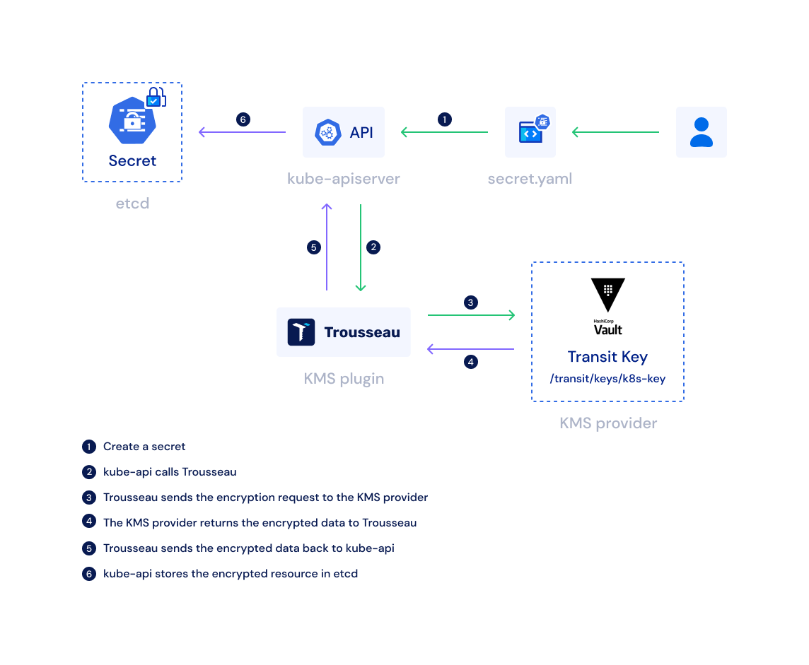

# KMS
This Lab uses [https://github.com/ondat/trousseau](https://github.com/ondat/trousseau) as KMS Plugin for Vault


> https://github.com/ondat/trousseau/blob/main/assets/Ondat%20Diagram-w-all.png

## Requirements
For this lab youre going to need `kubectl`, `helm` and `jq` installed.

Also in your `terraform.tfvars`:

```yaml
# terraform.tfvars
kubernetes = {
  enabled                  = true
  kms                      = true
}
```

You then can bootstrap the cluster using `make bootstrap`

## Walkthrough
### Verify that Kubernetes Secrets are currently unencrypted in etcd

```bash
# create any secret
$> kubectl create secret generic secret-pre-deploy -n default --from-literal=key=value

# output the secret in k8s storage
$> kubectl -n kube-system exec etcd-vault-playground -- sh -c "ETCDCTL_API=3 etcdctl --endpoints=https://127.0.0.1:2379 --cert /var/lib/minikube/certs/etcd/server.crt --key /var/lib/minikube/certs/etcd/server.key --cacert /var/lib/minikube/certs/etcd/ca.crt get /registry/secrets/default/secret-pre-deploy" | hexdump -C
00000000  2f 72 65 67 69 73 74 72  79 2f 73 65 63 72 65 74  |/registry/secret|
00000010  73 2f 64 65 66 61 75 6c  74 2f 73 65 63 72 65 74  |s/default/secret|
00000020  2d 70 72 65 2d 64 65 70  6c 6f 79 0a 6b 38 73 00  |-pre-deploy.k8s.|
00000030  0a 0c 0a 02 76 31 12 06  53 65 63 72 65 74 12 d0  |....v1..Secret..|
00000040  01 0a b7 01 0a 11 73 65  63 72 65 74 2d 70 72 65  |......secret-pre|
00000050  2d 64 65 70 6c 6f 79 12  00 1a 07 64 65 66 61 75  |-deploy....defau|
00000060  6c 74 22 00 2a 24 36 36  35 36 62 62 64 65 2d 32  |lt".*$6656bbde-2|
00000070  65 36 33 2d 34 66 62 61  2d 61 35 63 38 2d 65 61  |e63-4fba-a5c8-ea|
00000080  32 33 63 39 62 38 34 32  32 30 32 00 38 00 42 08  |23c9b842202.8.B.|
00000090  08 be ac d5 ad 06 10 00  8a 01 60 0a 0e 6b 75 62  |..........`..kub|
000000a0  65 63 74 6c 2d 63 72 65  61 74 65 12 06 55 70 64  |ectl-create..Upd|
000000b0  61 74 65 1a 02 76 31 22  08 08 be ac d5 ad 06 10  |ate..v1"........|
000000c0  00 32 08 46 69 65 6c 64  73 56 31 3a 2c 0a 2a 7b  |.2.FieldsV1:,.*{|
000000d0  22 66 3a 64 61 74 61 22  3a 7b 22 2e 22 3a 7b 7d  |"f:data":{".":{}|
000000e0  2c 22 66 3a 6b 65 79 22  3a 7b 7d 7d 2c 22 66 3a  |,"f:key":{}},"f:| # unencrypted key
000000f0  74 79 70 65 22 3a 7b 7d  7d 42 00 12 0c 0a 03 6b  |type":{}}B.....k|
00000100  65 79 12 05 76 61 6c 75  65 1a 06 4f 70 61 71 75  |ey..value..Opaqu| # unencrypted value
00000110  65 1a 00 22 00 0a                                 |e.."..|
00000116
```

### Deploy Trousseau 
```bash
# troussea has been deployed as a daemon set in kube-system namespace
$> kubectl get ds -n kube-system     
NAME                     DESIRED   CURRENT   READY   UP-TO-DATE   AVAILABLE   NODE SELECTOR            AGE
kube-proxy               1         1         1       1            1           kubernetes.io/os=linux   116s
trousseau-kms-provider   1         1         1       1            1           <none>                   46s

# a config map has been mounted into the daemon set, specifying the vault server and the vault token 
$> kubectl describe cm trousseau-config -n kube-system
Name:         trousseau-config
Namespace:    kube-system
Labels:       <none>
Annotations:  <none>

Data
====
cfg:
----
provider: vault
vault:
  keynames:
    - kms
  address: https://host.minikube.internal
  token: hvs.CAESIJGPZdckGe6vN3-bMUzBmT3XywsQ8eNMWZljladJKsszGh4KHGh2cy5Tb3dpQjNjOEJuWHM2cVk2anhNcWtFSEQ # periodic & orphan token

# Troussea creates a unix socket on the minikube host 
$> minikube ssh "ls -la /opt/trousseau-kms"
vaultkms.socket
```

### Enabling Troussea as a KMS Provider
```bash
# create cfg dir
$> minikube ssh "sudo mkdir /opt/cfg"

# copy encryption config
$> minikube cp ./k8s-minikube/files/encryption_provider_config.yml vault-playground:/opt/cfg/encryption_provider_config.yml

# copy kube-api config to static pod dir
$> minikube cp ./k8s-minikube/files/kube-api-server.yml vault-playground:/etc/kubernetes/manifests/kube-apiserver.yaml

# wait for all pods running
$> kubectl get pod -n kube-system
NAME                                       READY   STATUS    RESTARTS      AGE
coredns-787d4945fb-5fcwd                   1/1     Running   0             5m
etcd-vault-playground                      1/1     Running   0             5m15s
kube-apiserver-vault-playground            1/1     Running   0             19s      # api server restarted
kube-controller-manager-vault-playground   1/1     Running   0             5m13s
kube-proxy-vqlvn                           1/1     Running   0             5m
kube-scheduler-vault-playground            1/1     Running   0             5m14s
storage-provisioner                        1/1     Running   3 (36s ago)   5m13s
trousseau-kms-provider-jrflz               1/1     Running   0             4m28s
```

### Verify Secrets are now encrypted 
```bash
# create any secret
$> kubectl create secret generic secret-post-deploy -n default --from-literal=key=value

# show secret in etcd
$> kubectl -n kube-system exec etcd-vault-playground -- sh -c "ETCDCTL_API=3 etcdctl --endpoints=https://127.0.0.1:2379 --cert /var/lib/minikube/certs/etcd/server.crt --key /var/lib/minikube/certs/etcd/server.key --cacert /var/lib/minikube/certs/etcd/ca.crt get /registry/secrets/default/secret-post-deploy" | hexdump -C
00000000  2f 72 65 67 69 73 74 72  79 2f 73 65 63 72 65 74  |/registry/secret|
00000010  73 2f 64 65 66 61 75 6c  74 2f 73 65 63 72 65 74  |s/default/secret|
00000020  2d 70 6f 73 74 2d 64 65  70 6c 6f 79 0a 6b 38 73  |-post-deploy.k8s|
00000030  3a 65 6e 63 3a 6b 6d 73  3a 76 31 3a 76 61 75 6c  |:enc:kms:v1:vaul|
00000040  74 70 72 6f 76 69 64 65  72 3a 00 00 b3 d5 f9 b3  |tprovider:......|
00000050  d3 fe fd 55 41 4d 67 99  56 f2 7f 17 01 79 63 76  |...UAMg.V....ycv|
00000060  59 09 82 73 bc 1b ac 11  32 a9 2a ac f6 cd 55 c4  |Y..s....2.*...U.|
00000070  0d da b9 49 a8 28 c1 65  25 bd c2 06 d0 dd 41 9d  |...I.(.e%.....A.|
00000080  ed 28 57 96 06 9b 60 ff  9b 24 ae 53 52 d2 b1 23  |.(W...`..$.SR..#|
00000090  74 16 ec 8f 40 54 2f 6b  c8 bc af a9 08 30 76 c1  |t...@T/k.....0v.|
000000a0  10 4c 99 42 aa 0b a5 85  d2 63 b8 42 5b b3 63 c4  |.L.B.....c.B[.c.|   # encrypted secret
000000b0  00 6a 4d 1e db e6 49 6b  8a d5 df 16 d5 4d f8 ad  |.jM...Ik.....M..|
000000c0  3d 9a a9 42 0f f1 27 fe  17 94 47 97 d7 30 d4 26  |=..B..'...G..0.&|
000000d0  ae 22 b4 97 09 25 ab 34  38 0f f8 8d ad 41 ce 01  |."...%.48....A..|
000000e0  45 fd d9 d9 66 d3 f8 9d  08 d6 40 35 87 09 72 2b  |E...f.....@5..r+|
000000f0  b6 d8 ea 2b 3c 67 91 08  31 26 6b 21 e8 cd 53 97  |...+<g..1&k!..S.|
00000100  a2 00 53 2d c6 d5 9b ac  fc ba ed b7 85 2e 3e 8c  |..S-..........>.|
00000110  7d 14 a3 17 fa bb 1c 5d  d5 8c 7a 1c 4d e4 5a 86  |}......]..z.M.Z.|
00000120  52 6d 11 49 dc 39 67 83  1f 8c 9c d8 53 60 79 70  |Rm.I.9g.....S`yp|
00000130  ba 95 0e 80 92 51 1e 10  77 f3 72 13 e0 bf 18 a7  |.....Q..w.r.....|
00000140  5f 62 6d de 41 dd e0 fb  3b 5f 53 e8 2e b8 a2 c1  |_bm.A...;_S.....|
00000150  47 da 84 49 b7 2a 0b 0a                           |G..I.*..|
00000158
```

### Encrypt all existing secrets
```bash
$> kubectl get secrets --all-namespaces -o json | kubectl replace -f -
```