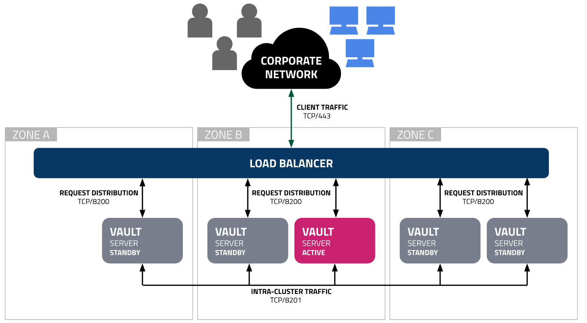

# Vault


> https://developer.hashicorp.com/vault/tutorials/day-one-raft/raft-reference-architecture

After a succesfull bootstrapping, you should be able to log into your local Vault HA Cluster by opening [https://127.0.0.1](https://127.0.0.1) in your browser.
Since the CA File is not trusted by your System you the browser will mark the page is insecure, which is fine for now.

## Configuration
See the final Vault Configuration:

```bash
$> docker exec -it vault-01 sh -c "cat /vault/config/vault.hcl"
ui = true
disable_mlock = true
api_addr = "https://{{ GetPrivateIP }}:8200"
cluster_addr = "https://{{ GetPrivateIP }}:8201"

listener "tcp" {
  address="0.0.0.0:8200"
  tls_cert_file="/opt/tls/vault.crt"
  tls_key_file="/opt/tls/vault.key"
}

storage "raft" {
  path = "/vault/file/"

  retry_join {
    leader_api_addr = "https://vault-01:8200"
    leader_ca_cert_file = "/opt/tls/ca.crt"
    leader_client_cert_file = "/opt/tls/vault.crt"
    leader_client_key_file = "/opt/tls/vault.key"
  }
  retry_join {
    leader_api_addr = "https://vault-02:8200"
    leader_ca_cert_file = "/opt/tls/ca.crt"
    leader_client_cert_file = "/opt/tls/vault.crt"
    leader_client_key_file = "/opt/tls/vault.key"
  }
  retry_join {
    leader_api_addr = "https://vault-03:8200"
    leader_ca_cert_file = "/opt/tls/ca.crt"
    leader_client_cert_file = "/opt/tls/vault.crt"
    leader_client_key_file = "/opt/tls/vault.key"
  }

}

telemetry {
  disable_hostname = true
  prometheus_retention_time = "12h"
}
```

## CLI Authentication
A file `.vault_token` containing Vaults Root-Token has been created. This allos you to login to the Vault Cluster
Your shell can authenticate to the Vault Cluster using environment vars.

Simply source [`.envrc`](https://github.com/FalcoSuessgott/hashicorp-vault-playground/blob/main/.envrc) and run `vault status`

```bash
$> source .envrc

$> vault status
Key                     Value
---                     -----
Seal Type               shamir
Initialized             true
Sealed                  false
Total Shares            5
Threshold               3
Version                 1.12.2
Build Date              2022-11-23T12:53:46Z
Storage Type            raft
Cluster Name            vault-cluster-18051650
Cluster ID              3ae2ae33-ffb0-630e-c73c-5cd8755f81d4
HA Enabled              true
HA Cluster              https://172.16.10.10:8201
HA Mode                 active
Active Since            2023-10-06T07:55:40.738642219Z
Raft Committed Index    217
Raft Applied Index      217
```

## Vault HA Cluster Members
Verify the Raft HA Cluster members
```bash
$> vault operator raft list-peers
Node        Address              State       Voter
----        -------              -----       -----
vault-01    172.16.10.10:8201    leader      true
vault-03    172.16.10.12:8201    follower    true
vault-02    172.16.10.11:8201    follower    true
```
