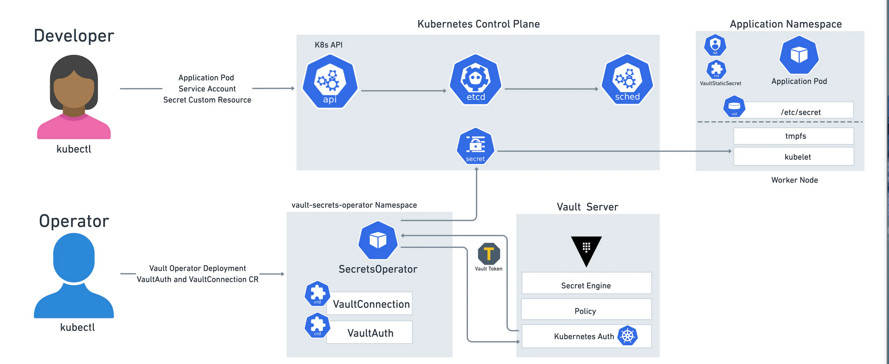

# Vault Secrets Operator


> https://www.hashicorp.com/blog/kubernetes-vault-integration-via-sidecar-agent-injector-vs-csi-provider

## Requirements
For this lab youre going to need `kubectl`, `helm` and `jq` installed.

Also in your `terraform.tfvars`:

```yaml
# terraform.tfvars
kubernetes = {
  enabled                  = true
  vault_secrets_operator   = true
}
```

You then can bootstrap the cluster using `make bootstrap`


## Overview
The following resources will be created:

1. The Vault Secrets Operator Helm Chart is going to be installed in the `vso` Namespace.
2. A Kubernetes Auth Role `vso` bound to the `vso` Namespace & Service Account
3. KVv2 Secrets under `vso/secrets` containing 2 Example Secrets
4. A policy (`vso`) that allows reading `/vso/secrets` Secrets
5. A CRD `VaultAuth` pointing to the Vault Server
6. A CRD `VaultStaticSecret` that creates a Kubernetes Secrets synchronized with the values stored in `/vso/secrets`

## Walkthrough
The Vault Secrets Operator (VSO) is going to be installed in the `vso` namespace using the [Helm Chart](https://helm.releases.hashicorp.com").

```bash
 $> helm list -n vso
NAME    NAMESPACE       REVISION        UPDATED                                         STATUS          CHART                           APP VERSION
vso     vso             1               2023-10-26 09:46:49.280228437 +0200 CEST        deployed        vault-secrets-operator-0.3.4    0.3.4
```

Additionally, a Vault Kubernetes Auth Role bounded to the Namespace and the `default` Service Account has been created:

```bash
# https://localhost/ui/vault/access/minikube-cluster/item/role/show/vso
$> vault read auth/minikube-cluster/role/vso
Key                                 Value
---                                 -----
alias_name_source                   serviceaccount_uid
bound_service_account_names         [default]
bound_service_account_namespaces    [vso]
token_bound_cidrs                   []
token_explicit_max_ttl              0s
token_max_ttl                       0s
token_no_default_policy             false
token_num_uses                      0
token_period                        0s
token_policies                      [vso]
token_ttl                           1h
token_type                          default
```

Also KVv2 Secrets under `/vso/secrets/` have been created:

```bash
# https://localhost/ui/vault/secrets/vso/kv/secrets/details?version=1
$> vault kv get vso/secrets
== Secret Path ==
vso/data/secrets

======= Metadata =======
Key                Value
---                -----
created_time       2023-10-26T07:46:46.998244367Z
custom_metadata    <nil>
deletion_time      n/a
destroyed          false
version            1

====== Data ======
Key         Value
---         -----
password    P@ssw0rd
username    Admin
```

A corresponding policy `vso` that allows reading the esm secrets has also been crated:

```bash
# https://localhost/ui/vault/policy/acl/vso
$> vault policy read vso
path "vso/" {
  capabilities = ["read", "list"]
}

path "vso/*" {
  capabilities = ["read", "list"]
}
```

A CRD `VaultAuth` has been created:

```bash
$> cat minikube/vso/vault_auth.yml
apiVersion: secrets.hashicorp.com/v1beta1
kind: VaultAuth
metadata:
  name: vso-vault-auth
  namespace: vso
spec:
  method: kubernetes
  mount: minikube-cluster
  kubernetes:
    role: vso
    serviceAccount: defaul
$> kubectl get vaultauths.secrets.hashicorp.com vso-vault-auth -n vso
NAME             AGE
vso-vault-auth   22m
```

And a CRD `VaultStaticSecret`:

```bash
$> cat minikube/vso/vault_static_secret.yml
apiVersion: secrets.hashicorp.com/v1beta1
kind: VaultStaticSecret
metadata:
  name: vso-vault-static-secret
  namespace: vso
spec:
  type: kv-v2
  mount: vso
  path: secrets
  destination:
    name: vso-secret
    create: true
  refreshAfter: 30s
  vaultAuthRef: vso-vault-auth
$> kubectl get vaultstaticsecrets.secrets.hashicorp.com vso-vault-static-secret -n vso
NAME                      AGE
vso-vault-static-secret   23m
```

Finally, a Kubernetes Secret containing the KVv2 Secrets from `/esm/secrets/` has been created:

```bash
$> kubectl get secret -n vso vso-secret -o json | jq '.data | map_values(@base64d)'
{
  "_raw": "{\"data\":{\"password\":\"P@ssw0rd\",\"username\":\"Admin\"},\"metadata\":{\"created_time\":\"2023-10-26T07:46:46.998244367Z\",\"custom_metadata\":null,\"deletion_time\":\"\",\"destroyed\":false,\"version\":1}}",
  "password": "P@ssw0rd",
  "username": "Admin"
}
```

You can update the secrets stored in Vault:

```bash
$> vault kv patch vso/secrets username=new-value
== Secret Path ==
esm/data/secrets

======= Metadata =======
Key                Value
---                -----
created_time       2023-11-13T12:11:09.131740262Z
custom_metadata    <nil>
deletion_time      n/a
destroyed          false
version            3
```

And see how the `vso-secret` gets the new value after `60s`:

```bash
$> kubectl get secret -n vso vso-secret -o json | jq '.data | map_values(@base64d)'
{
  "_raw": "{\"data\":{\"password\":\"P@ssw0rd\",\"username\":\"new-value\"},\"metadata\":{\"created_time\":\"2023-11-13T12:13:54.810581162Z\",\"custom_metadata\":null,\"deletion_time\":\"\",\"de
stroyed\":false,\"version\":2}}",
  "password": "P@ssw0rd",
  "username": "new-value"
}
```


## Addtional Resources
* [https://github.com/hashicorp/vault-secrets-operator/](https://github.com/hashicorp/vault-secrets-operator)
* [https://developer.hashicorp.com/vault/docs/platform/k8s/vso](https://developer.hashicorp.com/vault/docs/platform/k8s/vso)
* [https://developer.hashicorp.com/vault/tutorials/kubernetes/vault-secrets-operator](https://developer.hashicorp.com/vault/tutorials/kubernetes/vault-secrets-operator)
